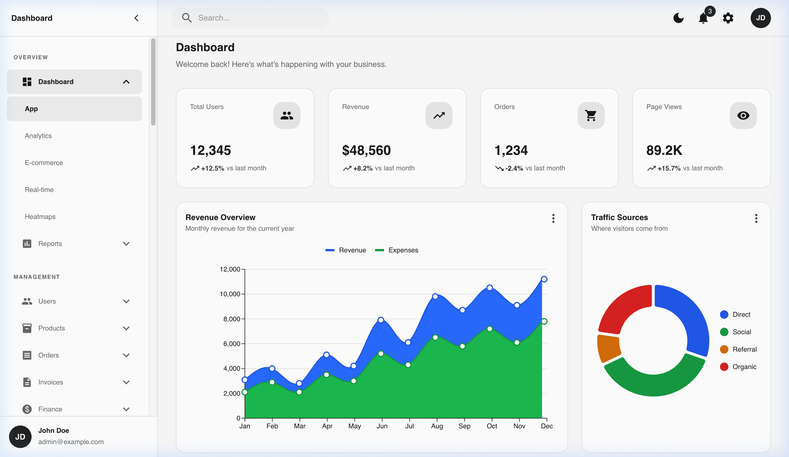
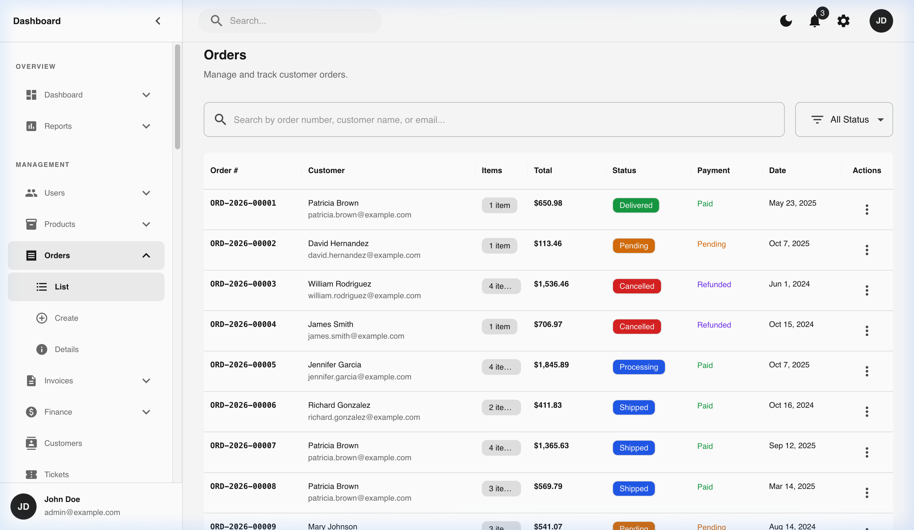
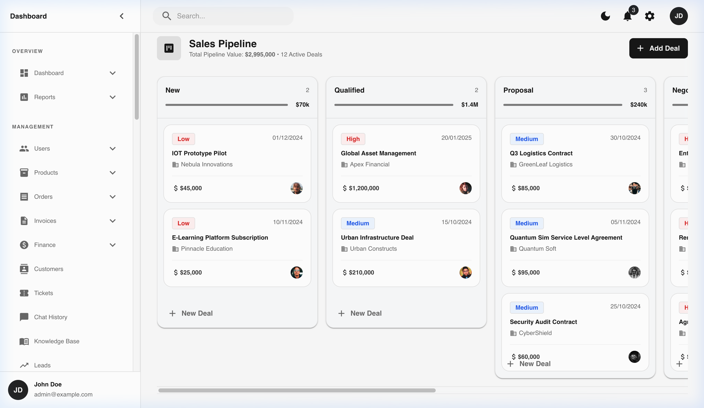
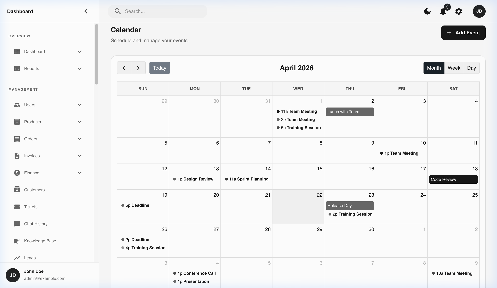

<p align="center">
  <h1 align="center">MUI Greyscale Admin Dashboard</h1>
  <p align="center">
    A modern, feature-rich admin dashboard built with React 19, MUI v7, and TypeScript.
    <br />
    Designed with a strict <strong>greyscale-first</strong> aesthetic — minimal, flat, and professional.
  </p>
</p>

<p align="center">
  <a href="#features">Features</a> •
  <a href="#screenshots">Screenshots</a> •
  <a href="#tech-stack">Tech Stack</a> •
  <a href="#getting-started">Getting Started</a> •
  <a href="#project-structure">Project Structure</a> •
  <a href="#design-philosophy">Design Philosophy</a> •
  <a href="#contributing">Contributing</a> •
  <a href="#license">License</a>
</p>

---

## Screenshots

<table>
  <tr>
    <td width="50%"></td>
    <td width="50%"></td>
  </tr>
  <tr>
    <td><em>Dashboard Overview — KPI cards, revenue charts, traffic breakdown</em></td>
    <td><em>Orders — Data grid with search, filters, and status chips</em></td>
  </tr>
  <tr>
    <td width="50%"></td>
    <td width="50%"></td>
  </tr>
  <tr>
    <td><em>CRM Deals — Drag-and-drop Kanban pipeline</em></td>
    <td><em>Calendar — FullCalendar with month/week/day views</em></td>
  </tr>
</table>

## Features

### 📊 Dashboards
- **Overview** — KPI cards with trend indicators, revenue/expense area chart, traffic pie chart, recent activity feed
- **Analytics** — Detailed breakdowns with bar, line, and area charts
- **E-commerce** — Sales metrics, top products, conversion funnels
- **Real-time** — Live-updating charts with streaming data indicators
- **Heatmaps** — Geographic and temporal data visualization

### 📋 Management
- **Users** — CRUD operations, profile pages, account settings, role assignment
- **Products** — Product catalog with categories, pricing, stock management
- **Orders** — Full order lifecycle with detail drawers, PDF invoice generation
- **Invoices** — Invoice builder with line items, tax calculation, PDF export via `@react-pdf/renderer`
- **Customers** — Customer directory with contact details and order history

### 💰 Finance
- **Transactions** — Searchable transaction ledger with status filtering
- **Refunds** — Refund request management and processing
- **Subscriptions** — Subscription plan tracking and analytics
- **Payouts** — Payout management with payment method details
- **Tax Reports** — Tax summary and reporting dashboards

### 🎯 CRM
- **Contacts** — Contact management with search and filtering
- **Companies** — Company directory with relationship tracking
- **Deals** — Drag-and-drop Kanban pipeline with deal values and stages

### 📦 Inventory & Logistics
- **Warehouses** — Warehouse management with capacity tracking
- **Stock Levels** — Real-time stock monitoring with adjustment dialogs
- **Suppliers** — Supplier directory with performance ratings
- **Returns** — Return request processing and status tracking
- **Shipping** — Shipment tracking with carrier integration

### 📣 Marketing
- **Coupons** — Coupon code management (percentage, fixed, free shipping)
- **Campaigns** — Campaign tracking with status and budget monitoring
- **Email Templates** — Email template editor with category management

### 🛠 Apps
- **Tasks** — Task management with priority, assignees, and due dates
- **Notes** — Three-column note-taking app with folders, tags, and pinning
- **Calendar** — Full calendar with FullCalendar.js (month/week/day views)
- **Kanban** — Generic Kanban board with drag-and-drop
- **Mail** — Email client interface with inbox, compose, and folders
- **Chat** — Real-time chat interface with conversations
- **File Manager** — File browser with grid/list views

### 🔐 Support & Security
- **Tickets** — Support ticket system with conversation threads
- **Chat History** — Customer chat transcript browser
- **Knowledge Base** — Article editor with rich text, categories, and search
- **Leads** — Lead management with conversion tracking
- **Roles & Permissions** — Role-based access control configuration
- **Two-Factor Auth** — 2FA setup and management
- **Audit Logs** — System activity logging and browsing
- **Active Sessions** — Session management and device tracking
- **API Keys** — API key generation and management

### ⚙️ System
- **Settings** — Application configuration panel
- **Payment Gateways** — Payment provider setup
- **Notifications** — Notification center with email and push preferences
- **Export Center** — Data export with format selection
- **Media Library** — Asset management with upload and organization
- **Components Showcase** — Living style guide with reusable components
- **Auth Pages** — Login, Register, Forgot Password (standalone layout)

### 🎨 Design System
- **Dark Mode** — Full dark/light mode toggle with theme persistence
- **Centralized Status Colors** — `statusColors.ts` provides theme-aware color functions for all status indicators
- **Responsive Layout** — Collapsible sidebar, mobile-friendly
- **Lazy Loading** — All routes are code-split for optimal performance
- **PDF Generation** — Invoice PDF export with `@react-pdf/renderer`

## Tech Stack

| Category | Technology |
|----------|-----------|
| **Framework** | [React 19](https://react.dev/) + [TypeScript](https://www.typescriptlang.org/) |
| **Build Tool** | [Vite 7](https://vite.dev/) |
| **UI Library** | [MUI v7](https://mui.com/) (Material UI) |
| **Data Grid** | [MUI X Data Grid](https://mui.com/x/react-data-grid/) |
| **Charts** | [MUI X Charts](https://mui.com/x/react-charts/) |
| **Date Pickers** | [MUI X Date Pickers](https://mui.com/x/react-date-pickers/) |
| **Calendar** | [FullCalendar](https://fullcalendar.io/) |
| **Drag & Drop** | [@hello-pangea/dnd](https://github.com/hello-pangea/dnd) |
| **Forms** | [React Hook Form](https://react-hook-form.com/) + [Zod](https://zod.dev/) |
| **Routing** | [React Router v7](https://reactrouter.com/) |
| **Animations** | [Framer Motion](https://www.framer.com/motion/) |
| **PDF** | [@react-pdf/renderer](https://react-pdf.org/) |
| **Icons** | [MUI Icons Material](https://mui.com/material-ui/material-icons/) |

## Getting Started

### Prerequisites

- **Node.js** 18+ (recommended: 20+)
- **npm** 9+

### Installation

```bash
# Clone the repository
git clone https://github.com/kjaniec-dev/mui-greyscale-admin-dashboard.git
cd mui-greyscale-admin-dashboard

# Install dependencies
npm install

# Start the development server
npm run dev
```

The app will be available at `http://localhost:5173`.

### Available Scripts

| Command | Description |
|---------|------------|
| `npm run dev` | Start Vite dev server with HMR |
| `npm run build` | TypeScript check + production build to `dist/` |
| `npm run lint` | Run ESLint across the codebase |
| `npm run preview` | Serve the production build locally |

## Project Structure

```
src/
├── assets/             # Static assets (images, fonts)
├── components/         # Reusable UI components
│   ├── cards/          # KPI cards, stat cards
│   ├── charts/         # Chart wrappers (ChartCard, LiveChartCard)
│   ├── common/         # Shared primitives (DetailInfoRow, EmptyState, etc.)
│   ├── drawers/        # Detail drawers (Order, Customer, Invoice, etc.)
│   ├── forms/          # Form dialogs and form components
│   ├── pdf/            # PDF generation (Invoice templates)
│   └── tables/         # DataGrid table wrappers
├── data/               # Mock datasets (42 files)
├── layouts/            # Layout shells
│   ├── AuthLayout.tsx  # Auth pages (Login, Register)
│   └── DashboardLayout/# Main dashboard with sidebar navigation
├── pages/              # Page components (27 domains)
│   ├── dashboard/      # Overview, Analytics, E-commerce, Real-time, Heatmaps
│   ├── orders/         # Order list, create, details
│   ├── crm/            # Contacts, Companies, Deals pipeline
│   ├── finance/        # Transactions, Refunds, Subscriptions, Payouts
│   ├── inventory/      # Warehouses, Stock, Suppliers, Returns, Shipping
│   ├── marketing/      # Coupons, Campaigns, Email Templates
│   ├── apps/           # Tasks, Calendar, Kanban, Mail, Chat, Files
│   └── ...             # Blog, Reports, Settings, Security, etc.
├── routes/             # React Router configuration (code-split)
├── theme/              # MUI theme configuration
│   ├── theme.ts        # Light/dark theme definitions (neutral palette)
│   ├── statusColors.ts # Centralized status color system
│   └── ThemeProvider.tsx# Theme context with dark mode toggle
└── utils/              # Shared utilities
    └── formatters.ts   # Date, currency, and text formatting
```

## Design Philosophy

This dashboard follows a **greyscale-first** approach inspired by [shadcn/ui](https://ui.shadcn.com/), built entirely with MUI primitives:

- **Colors**: Black, white, and grey tones only. No primary blues or greens. Color is reserved strictly for **status indicators** (success/error/warning chips) and **data visualization** (charts), and even then uses muted, desaturated tones.
- **Typography**: Inter font family with a clear hierarchy.
- **Surfaces**: Flat design with subtle borders instead of heavy shadows.
- **Status System**: Centralized in `src/theme/statusColors.ts` — provides `getStatusSolid()`, `getToneColor()`, and `getStatusColor()` functions that return theme-aware (light/dark) colors for any status string.
- **Consistency**: All drawers use `DetailInfoRow` for key-value pairs. All forms use the same submit button pattern. All data grids share the same styling conventions.

## Contributing

Contributions are welcome! Here's how to get started:

1. **Fork** the repository
2. **Create** a feature branch (`git checkout -b feat/my-feature`)
3. **Commit** using [Conventional Commits](https://www.conventionalcommits.org/) (`feat:`, `fix:`, `refactor:`, `docs:`)
4. **Verify** your changes pass lint and build:
   ```bash
   npm run lint && npm run build
   ```
5. **Open** a Pull Request with:
   - Description of user-facing changes
   - List of affected routes/components
   - Screenshots for UI updates

### Coding Conventions

- TypeScript strict mode — no `any` escape hatches
- Functional React components with hooks
- PascalCase for component files, camelCase for utilities
- Use shared utilities from `src/utils/formatters.ts` (never duplicate `formatCurrency`, `getInitials`, etc.)
- Use `getStatusSolid()` / `getToneColor()` from `src/theme` for all status colors
- Use `DetailInfoRow` for all key-value pairs in drawers

## License

This project is open source and available under the [MIT License](LICENSE).

---

<p align="center">
  Built with ❤️ using <a href="https://mui.com/">MUI</a> and <a href="https://react.dev/">React</a>
</p>
